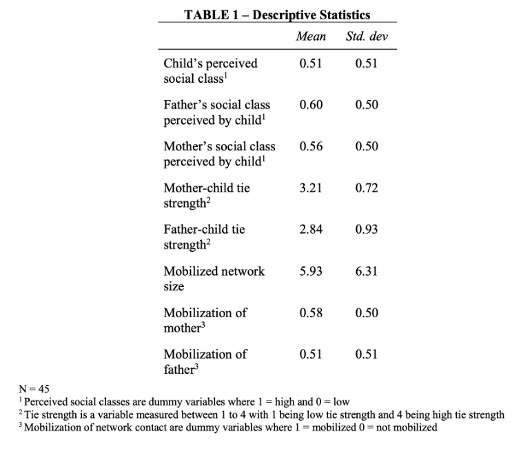
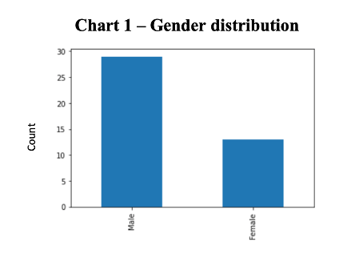
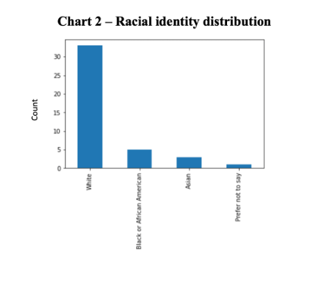
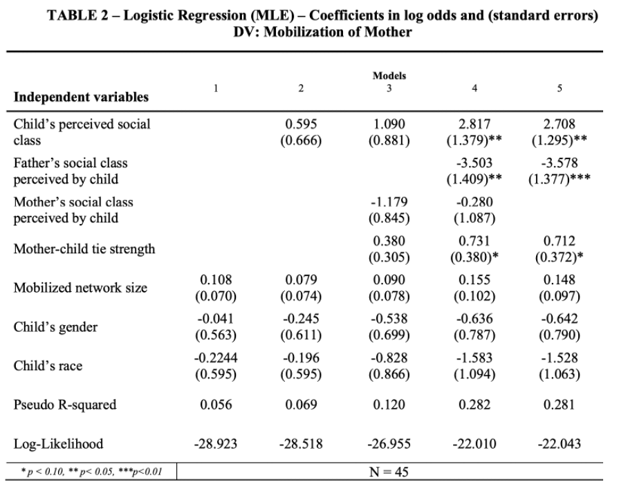
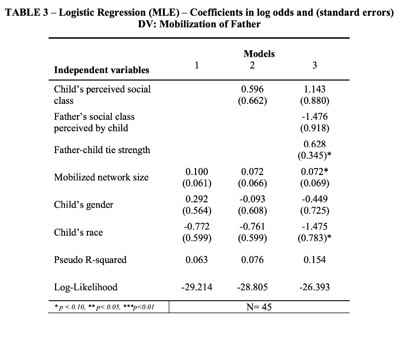

# How does tie strength and subjective social class affect mobilization of parental aid in the job search process?

The provided Jupyter notebooks are written in python 3.7.3. To install the required packages and dependences, please run the following code in reference to the provided `requirements.txt` file

```
pip install -r requirements.txt
```

## Dataset
[Amazon Mechanical Turk survey results, N = 45](https://github.com/macs30200-s22/replication-materials-helyap/blob/main/child-parent_network_cleaned.csv)

### Column labels:
* job_desc: description of job	
* e_class: respondent's perception of own social class
* network_size: respondent's estimate of mobilized network size	
* mother_activation: respondent's utilization of mother for instrumental aid
* father_activation: respondent's utilization of father for instrumental aid
* mother_closeness: respondent's estimate of closeness with mother
* mother_contact: respondent's estimate of frequency of contact with mother
* mother_class: respondent's perception of mother's social class
* father_closeness: respondent's estimate of closeness with father
* father_contact: respondent's estimate of frequency of contact with father	
* father_class: respondent's perception of own social class
* e_race: respondent's race
* e_gender: respondent's gender	
* e_ethnicity: respondent's ethnicity	
* att_check: attention check question

## Data analysis: 
* [Jupyter Notebook : Data Analysis](https://github.com/macs30200-s22/replication-materials-helyap/blob/main/child_network_survey_analysis.ipynb)

## Descriptive statistics
* 
* 
* 


## Results from logistic regression - mobilization of mother


## Results from logistic regression - mobilization of father


## Hypotheses and findings:
* H1: Tie strength is positively associated with an individual’s mobilization of their mother **only when accounting for the father’s social class**

* H2: Tie strength is positively associated with an individual’s mobilization of their father: **supported**

* H3: An individual is more likely to mobilize their mother for instrumental job search aid if they perceive the mother to have high social class: **not supported**

* H4: An individual is more likely to mobilize their father for instrumental job search aid if they perceive the father to have high social class: 
**not supported**

# Required packages
* statsmodel 0.13.2
* numpy 1.21.5
* pandas 1.3.5

### Instructions to conduct analyses:
1. Install the required dependencies
2. Run the provided Jupyter Notebook

# Citation:
* [Citation file](https://github.com/macs30200-s22/replication-materials-helyap/blob/main/CITATION.cff)
